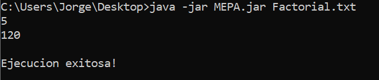

# MEPa
Compiler for MEPa programming language

MEPa is a programming language created for this project. The compiler analyze a source code in MEPa seeking lexical, syntactic and semantic errors.
If the source code is free of errors, the application executes the MEPa program until last instrucction (para) is found.

Example:

The following source code calculates factorial function.

``` Java
	inpp
	dsvs l1
l2  enpr 1
	apvl 1,-3
	apct 1
	cmig
	dsvf l3
	apct 1
	alvl 1,-4
	dsvs l4
l3  nada
	apvl 1,-3
	rmem 1	
	apvl 1,-3
	apct 1
	sust
	llpr l2
	mult
	alvl 1,-4
l4  rtpr 1,1
l1 	nada
	rmem 1
	leer
	llpr l2
	impr
	para
```
The image below test the previous program with an input.



